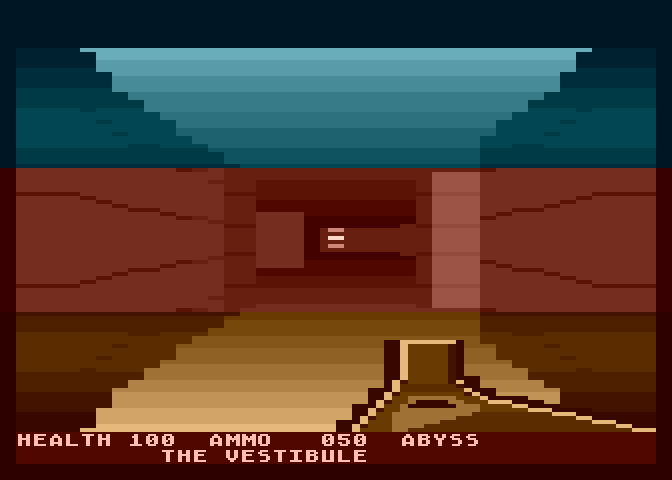
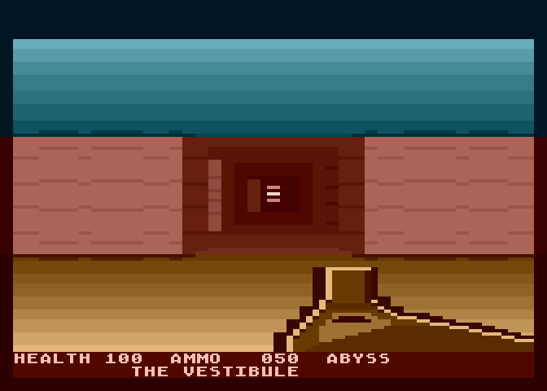
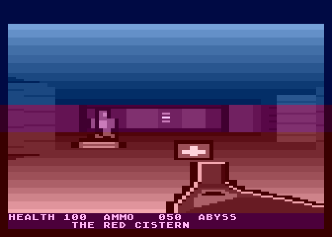
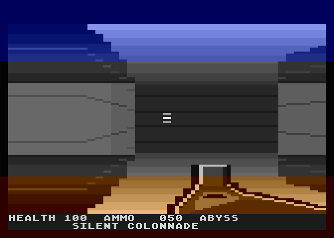
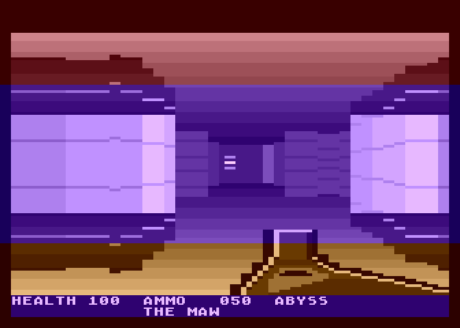
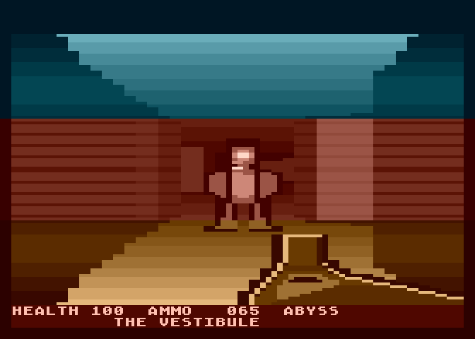
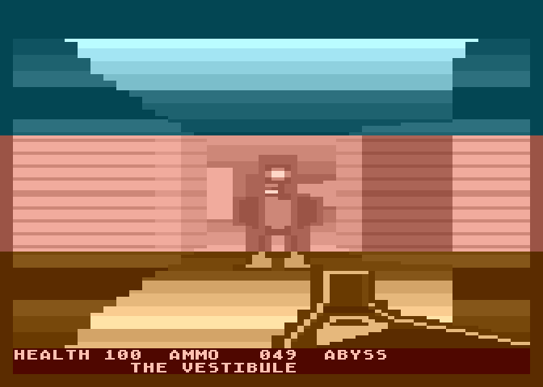
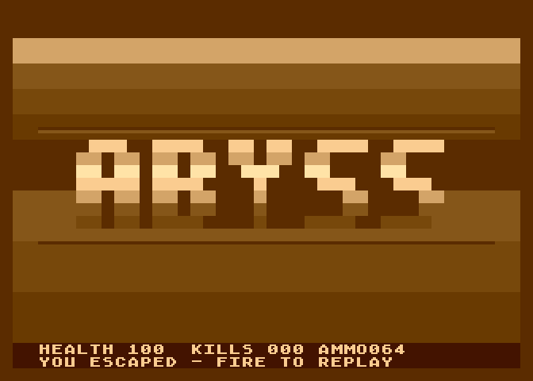

<h1 align="center">ABYSS</h1>

<p align="center">
  <b>A DOOM-flavoured first-person shooter for a stock Atari 800XL.</b><br>
  40-column raycaster, 6502 assembly, 29 KB, one night. Runs on the real thing.<br><br>
  <a href="https://abyss.gillett-projects.com"><b>&#9654;&#xFE0E; PLAY IT IN YOUR BROWSER</b></a>
</p>

<p align="center">
  
</p>

<p align="center">
  
  
  
  
  
</p>

---

> **Status — it runs on real hardware.** Confirmed on a PAL Atari 800XL loading
> from a Lotharek SIO2SD, on a CRT. Getting there took three attempts and taught
> this project its most useful lesson — that story is
> [further down](#what-real-hardware-taught-us), not up here.

## What this is

A first-person raycast shooter for an **unexpanded Atari 800XL** — 64 KB, PAL,
stock hardware, no memory expansion and no cartridge tricks. It draws a shaded
3D view at about ten frames a second and answers your joystick at the full
50 Hz regardless of what the renderer is doing. Four levels, four kinds of enemy,
a shotgun, doors, pickups and a POKEY sound engine, in **29 KB** of 6502
assembly.

Raycasting on a 1.77 MHz 6502 is mostly a fight about cycles: a full-screen
repaint costs more than a frame, so every pixel has to be cheap and every wasted
one has to go. Most of what is interesting here is *how* that fight was won —
and where it was lost, which is written down just as plainly.

If you just want to see it: **[play it in your browser](https://abyss.gillett-projects.com)**,
or grab [`abyss.xex`](abyss.xex) and put it on your own machine.

---

## The four floors

|  |  |
|:--:|:--:|
| <br>**THE VESTIBULE** — teal vault, red stone, gold floor | <br>**THE RED CISTERN** — a columned hall in magenta |
| <br>**SILENT COLONNADE** — grey stone under a blue vault | <br>**THE MAW** — violet stone, burning red sky |

<table>
<tr>
<td align="center"><br><sub>A husk, three cells out</sub></td>
<td align="center"><br><sub>The flash <b>lights</b> the room</sub></td>
<td align="center"><br><sub>Out, with what you carried</sub></td>
</tr>
</table>

Every screenshot in this README is generated by `tools/gallery.py`, which asserts
each frame against the game state it claims to show and hashes them against each
other so an accidental duplicate can't pass silently. It has told a lie once and
been rebuilt not to.

---

## Run it

Grab [`abyss.xex`](abyss.xex) and load it however you load an XEX — an SD
cartridge, an SIO2SD, `atari800 abyss.xex`, Altirra, anything.

Joystick in port 1. **Fire** starts, and fires. **START** holds up the map.
That is the whole control scheme.

**New to it?** [**`docs/PLAYING.md`**](docs/PLAYING.md) is the player's manual —
controls, what the shotgun does at each range, how doors and keys work, how the
map earns what it shows you, and how to recognise the way out. Two minutes, and
it is the difference between wandering and descending.

- **PAL 800XL/130XE, 64K.** It has only ever been run on PAL.
- BASIC is disabled by the program itself now, so you should not need to hold
  OPTION. If a stubborn loader ever gets in the way, holding OPTION at power-on
  is the belt-and-braces.

---

## What it does

- **Raycast 3D** in GTIA mode 9 — 40 rays across an 80×96 buffer, each row shown twice to fill 192 scanlines. Mode 9 gives 16 luminances of a *single* hue per scanline, which shapes everything below.
- **~10.2 fps** world render, with a **50 Hz feedback layer** that never stalls:
  input, weapon, kick, bob, audio and HUD all run in the VBI, decoupled from the
  renderer. That decoupling is the single thing that makes 10.2 fps feel
  deliberate rather than broken.
- **Momentum movement** — DOOM's friction model, wall sliding, a body radius
- **A shotgun** with screen kick, range-banded damage, and a muzzle flash that
  *lights* the room rather than replacing it
- **Enemies** with a real state machine — dormant → chase → telegraph → attack →
  recover, plus pain, death, gibbing and **infighting** — drawn as depth-sorted
  billboards at continuous scale, standing on the real floor line and clipped
  against the wall buffer
- **Four hand-authored levels**, RLE-packed (6 KB of planes into 1,654 bytes) and
  decompressed on descent, each with its own hue triple, its own lighting, and
  **the level designer's own enemy placements** — 18 of the 20 spawns
- **Per-cell lighting** and **per-material shading**: doors and exits read
  *brighter* than the wall they sit in, and secret doors are asserted to be
  pixel-identical to stone
- **A POKEY audio engine**, 11 frame-stepped effects with priority
- Doors, pickups, weapon bob, death and retry, a title screen, and an end card
  that reports what you escaped with

---

## How it renders

The core problem on this machine is that a full-screen repaint costs more than a
frame. The answer is a chain of small decisions, each measured.

**Unrolled store chains — "suffix ladders", my name for them.** A column of wall
is a vertical run of identical pixels, and the usual way to draw one is a loop
with a counter and a compare. Instead, each column is drawn by `JSR`-ing
*part-way into* a long unrolled run of `sta SCREEN+row*40,x`, entering at an
offset computed from how tall that column's wall is. The rows are stored as
symmetric pairs — 0, 95, 1, 94, … — so entering at slot *k* paints exactly rows
*k* to *95−k* and returns. The run length is chosen by where you jump in: no loop
counter, no compare per pixel, no overdraw. **5 cycles a pixel, which is the
floor for a 6502** — you cannot store a byte for less.

**96 buffer rows, each shown twice.** Halving the vertical resolution halves the
fill cost, and ANTIC will happily display each row twice for nothing. Putting a
blank scanline between rows instead would also have halved ANTIC's DMA and given
the CPU more cycles — but tried, the black lines dominated the picture, so that
saving was given up and the fill saving kept.

**Gradients baked in as immediate operands.** `lda #$66 / sta SCREEN+r*40,x`
costs two cycles more per pixel than a constant fill and needs no table fetch,
which is how the ceiling and floor gradients are very nearly free.

**Per-cell lighting for one `adc`.** The attribute plane sits exactly `$0400`
above the solid plane, so the light byte is one add off the DDA's map pointer.
It is sampled from the *open cell the ray was in when it hit*, not from the wall
— the level compiler paints light onto open space, so sampling the wall (93–97%
one value on every level) threw the entire lighting design away. Light is applied
as **apparent distance** (`dist + LIGHTOFS[light]`), reusing the shade ramp: dark
corridors and lit arenas for eight bytes of table.

**Double buffering** with two ladder sets `$0400` apart, selected by adding a
byte to the dispatch address. The flip writes the `SDLSTL` *shadow*, so the OS
installs it at vertical blank and the swap is beam-synced for free.

**Ramps are reciprocals, not square roots.** The ceiling and floor curves were
textbook falloffs that resolved to *two* and *three* luminance values on screen,
because the rows you can actually see span about 1 to 2.5 cells of depth and sqrt
is flattest exactly there. A reciprocal put seven and twelve levels in the same
rows for the same zero cycles.

**Dark caps where a wall leaves its colour band.** Colour in this mode is set
per horizontal band (see the limitation below), and the wall's band is 36 rows
tall; a nearer wall is taller than that and spills out of it top and bottom. The
ladder pairs slot *k* with rows *k* and `95−k`, so slots 0–29 are the only ones
that can paint outside the band — and they were doing it in wall luminance, which is a bright cyan bar
above every near wall and a gold one below. Emitting dark immediates for those
thirty slots removed 764 stray pixels *and* ran faster than the zero-page load it
replaced.

---

## Three things worth stealing

### 1. A full-screen brightness flash in a mode that cannot do one

In GTIA 9 the pixel nibble is OR'd into `COLBK`'s **low** nibble. Every reference
says keep that nibble zero. Writing a non-zero value instead lifts the whole
picture — a full-screen flash, four register writes, in a mode that is not
supposed to have one.

It is an **OR and not a floor**, which matters, because OR *destroys* levels: the
surviving count is `16 >> popcount(nibble)`. A nibble of `%1110` leaves two
luminances and the image ceases to exist. Single-bit nibbles keep eight.

The counter-intuitive part is *which bit, where*. OR collapses pairs — `3|8` and
`11|8` are both 11 — so a wall at 3 and an enemy at 11 can merge under one bit and
stay apart under another. Counting the enemy's silhouette pixels that become
identical to the wall beside them, out of 194:

| bit | enemy pixels lost |
|---|---|
| none (no flash) | 5 |
| **8 — the brightest step** | **5** |
| 4 | 11 |
| 2 | 23 |

The brightest step is free, and the **dim tail of the decay** is what hides your
target — so a plain 8/4/2 decay runs from the best value to the worst over the
three frames of the one effect whose job is to show you what you shot.

Then run the same measurement on the **floor** band and the held weapon and it
comes out *the other way round*: bits 2 and 4 preserve 100% of the weapon's
edges, bit 8 loses 19%, because the floor's own luminances run 6–11 and the top
bit folds the gun's tones into them.

**The same effect, over two different backgrounds, needed opposite settings, and
no amount of reasoning from the first result would have produced the second.**
Both were one measurement away.

### 2. The 50 Hz layer is the whole trick

The world redraws at ~10.2 fps. Input, weapon animation, screen kick, weapon bob,
audio stepping and the HUD all run in the 50 Hz vertical-blank interrupt and
never wait for it. Pull the trigger and the gun fires *on the next video frame*,
with a kick that decays linearly across two world renders. The game feels
responsive because the parts you feel are not on the slow path at all.

### 3. Measure the picture, not the variable

Every rendering defect in this project was found by counting pixels, and several
were invisible to the eye even once you knew they were there. The acceptance
sweep reads the colour-register byte back out of the screen buffer, where the low
nibble is the exact pixel luminance, and asserts things like *the flash must not
cost more than two silhouette pixels* and *the gun must still be drawn on every
level*.

A variable moving proves nothing reached the screen.

---

## Measured, not claimed

Everything in this table comes out of three tools that drive the real binary
through libatari800 **in process** — no emulator subprocess, nothing left running
afterwards. `tools/verify.py` is the *acceptance sweep*: 67 checks that play the
game and assert on what comes back, from "the gun is drawn on every level" to a
full path-finding playthrough. `tools/metrics.py` measures what the picture
contains; `tools/gallery.py` takes the screenshots.

| | |
|---|---|
| **Acceptance sweep** | **75 / 75** — every one of them asserting on pixels or game state, not on a variable having changed |
| Full playthrough | all four levels, ~22 shots, 0 deaths — path-finding to each **real** exit |
| Render rate | 11.9 fps empty corridor, 9.3 fps with an enemy in your face |
| The bestiary, measured | hulk 120→60→0 over exactly two point-blank shots; gunner attacking within 150 frames; hulk 1.23× a husk's height | all sweep checks |
| Knockback | impulse $60 vs top speed $40, the frame damage lands | set, not added — hits cannot stack into a launch |
| A fireball on screen | 76 px over 6 rows at 3 cells | was ~200 px over 28 rows: drawn as a full-size walking husk since projectiles went in |
| Nukage | 16 HP lost in 5 s standing in THE RED CISTERN's channel, 0 beside it | 32 hurt cells authored since the levels were written; the runtime finally reads the bit |
| Endurance, one boot | **60,000 frames**, 103 deaths and retries, **0 invariant failures** |
| Render rate under load | 8.6 fps, flat across 45,000 of those frames |
| Randomised soak | 20,000 frames, 5,000 per level from a fresh boot |
| Passive play | dead in 31 s — was 36–38 s before the enemies moved onto the designer's own positions |
| Level decompression | 4/4 byte-exact, compared against source after every descent |
| Audio VBI cost | 693 cycles worst case — 58% of what a vertical blank affords |
| Build reproducibility | byte-identical across consecutive clean builds |
| Memory boundaries asserted | 15 at assembly time, 9 at generate time — every fixed address has a guard either side, and each was broken once on purpose to prove it fires |
| Orphaned processes | none, by construction |

Three of those move between runs — the game's own randomness reaches them — so
they are quoted as measured ranges. The sweep asserts the *property*, not the
number.

---

## What real hardware taught us

The emulator was green more than 130 times before this ever reached a CRT. The
CRT then found two bugs in two attempts — and neither was a mistake the emulator
*could* have caught, which turned out to be the point.

**Attempt 1 — it loads, and the picture is garbage.** Three modules live in
`$A000–$BFFF`. On an XL that address range is the BASIC ROM unless you say
otherwise, and the emulator had been booting with BASIC *disabled* while the
machine boots with it *enabled*. The program was loading straight into ROM. Fixed
with an INIT segment that clears PORTB bit 1 before those segments load.

**Attempt 2 — the title screen is perfect, and the picture rolls.** The display
list was asking ANTIC for **248 scanlines** against a hard limit of 240, so the
last status row was still doing playfield DMA when vertical sync should have
been. Two of the four status rows were blank anyway; dropping them costs nothing
visible and brings the frame to 232.

**Attempt 3 — it boots, locks, and plays.** Two later runs confirmed everything
built since, including the renderer changes, which are the riskiest kind.

Neither bug was visible to the emulator, for two different reasons worth
separating. The first was a *configuration* difference — someone could have
found it by reading a manual. The second was **structural**: the emulator renders
a fixed 240-line window, so it clips an over-long frame and shows you a stable
picture. It cannot display a CRT losing lock at any level of diligence.

Both are now assertions in the test sweep. The question they left behind is the
one this project has found most useful since: not *does it pass?* but **what can
this harness not see, even in principle?**

---

## What is **not** done

Stated plainly, because a prototype that oversells itself is worse than one that
doesn't.

- ~~Never run on real hardware~~ **It runs on real hardware**, and every feature
  in it has been seen on a CRT — including the renderer changes, which are the
  ones most likely to behave differently there. See
  [what real hardware taught us](#what-real-hardware-taught-us).
- ~~No keys or locked doors~~ — **FIXED.** Two levels had authored a locked
  door and its matching key since they were written, and the compiler flattened
  them to plain doors because the runtime had no keys. It has them now: THE RED
  CISTERN's red door and THE MAW's yellow one refuse you until you have found
  the key its designer placed.
- **The authored content layer is only half used.** The levels specify 39 actors
  across 5 types and 42 items across 11. The game now takes the
  actors' positions AND types — husk, gunner, spitter, hulk — plus all 16
  pickup positions. Still collapsed: 11 authored item types become medkits and
  shells, and the maw ships with hulk stats until it gets real boss behaviour.
- **Triggers are not loaded**, so sealed monster closets never open. SILENT
  COLONNADE authors thirteen actors and only five are reachable.
- **Audio went unheard for most of the project** — verified as POKEY register
  traces only, until the hardware run and [the browser build](https://abyss.gillett-projects.com)
  finally played it out loud.
- **The held weapon does not reliably read as held.** It is drawn on every level —
  measured, 109–118 outline pixels — with an outline, a lit bevel and a barrel,
  running off the bottom-right corner. Six redraws and two attempts at crossing
  the hue seam are all in the DEVLOG with what each one failed at. It is much
  better than it was and it is not solved.
- **One hue per scanline.** GTIA mode 9 gives 16 luminances per pixel but takes
  its hue from `COLBK`, which is per-scanline — so a line holding both wall and
  ceiling must pick one. That part is the mode and cannot be fixed. What *was*
  fixable is **where** the picture changes colour. Those boundaries — call them
  seams — used to sit at rows 30 and 65 permanently, so 44% of a wall two cells
  away came out in the ceiling's and floor's colours. Each seam is now placed at
  the median wall top, recomputed every render, which puts **99.5%** of a near
  wall in the wall's own hue (measured by hue, on the pixels). Down a corridor it
  is a trade rather than a win — 53.7% to 79.0%, at the cost of some ceiling near
  the horizon taking the wall's hue — because the two side walls disagree about
  where the seam belongs.
- ~~The masonry lines on the walls don't recede~~ — **FIXED**, after a visitor
  spotted it from a screenshot without ever seeing this list. The horizontal
  lines suggesting courses of stone are now drawn per column, at fractions of
  that column's own wall height, so they both **scale with distance** (15 screen
  rows apart on a near wall, 6 on a far one, where it used to be 4 everywhere)
  and **follow the wall's perspective** rather than running dead level — down a
  corridor they converge toward the vanishing point. Net −1,077 bytes, and it
  replaced an earlier, bigger fix that scaled correctly but could never slope,
  because a store chain entered at an offset always lands a given byte on a fixed
  screen row.

---

## Build it

```sh
./build.sh                     # -> abyss.xex
python3 tools/verify.py        # 75-point acceptance sweep, in process
python3 tools/metrics.py       # what the picture actually contains, measured
python3 tools/gallery.py       # screenshots, each checked against game state
```

`build.sh` regenerates the sprite, weapon and title art before assembling, every
time — a preview script once imported a generator, importing ran it, running it
rewrote `weapon.bin`, and the next build silently shipped a discarded draft. A
generated file a build does not regenerate is a stale file with a plausible
timestamp.

Two third-party binaries are **not** committed here, because they are not mine to
redistribute:

| | |
|---|---|
| [**MADS**](https://mads.atari8.info/) | the assembler. Put it in `tools/`, or set `$MADS`. |
| [**libatari800**](https://github.com/atari800/atari800) | the headless emulator core, built with `--target=libatari800`. Put it in `tools/`, or set `$A8_LIBATARI800`. |

Nothing else is needed — no ROM images (the core has AltirraOS built in), no
Python packages beyond Pillow for the screenshot tools.

Level sources are plain ASCII in [`levels/`](levels/) and compile via
`tools/levels.py`; the format is documented in
[`docs/MAPFORMAT.md`](docs/MAPFORMAT.md).

---

## Repo layout

```
src/            6502 sources — engine, game layer, sprites, actor AI, audio, title
tools/          the level compiler, the art generators, and the three harnesses
levels/         the four levels, as ASCII maps you can read and edit
docs/           the player's manual, the map format, and the frozen interface contract
gallery/        the screenshots in this README, each asserted against game state
builds/         fifteen milestone binaries, in the order they were built
abyss.xex       the thing you run
DEVLOG.md       the whole story, wrong turns included
```

---

## The lessons

[**`LESSONS.md`**](LESSONS.md) — the way of working that produced this, written
as thirteen transferable principles, each with the failure that earned it. None
of them are about the 6502.

## The DEVLOG

[**`DEVLOG.md`**](DEVLOG.md) is 1,600 lines and is the part worth reading. It
records the wrong turns, because that is where the reusable knowledge is:

- the value borrowed for one purpose that was written back over the value another
  purpose depended on, so **wall height depended on how brightly a cell was lit**
  and every wall in the game rendered at a quarter of its size
- the **44 green checks on a build in which no level contained an exit**, because
  the exit check poked an exit into the map before walking into it
- the check that was an *implementation written down as an expectation*, which
  failed the moment the code improved and would have passed a change that made
  the picture worse
- the gallery where **every screenshot was true, correctly labelled and
  state-asserted**, and the set of them still told three independent reviewers
  something about the game that was not so
- the BASIC ROM window, and 130 green sweeps run against a machine configuration
  the hardware does not boot into

---

## Credits

Built by [Claude Code](https://claude.com/claude-code) with Tony Gillett, over a
single night, 2026-07-31 → 08-01. Level design, the actor AI and the audio engine
were each produced by a separate agent working from a frozen interface contract;
the renderer, game layer, sprite renderer and integration were written in the
main thread. Fourteen rounds of adversarial visual review took it from 4.5/10 to
the state you see here — the five rounds that found the most were the ones given
only the screenshots and forbidden the source.

The research that shaped it — a study of *Rescue on Fractalus*, *Project M* and
the DOOM source — is in [`docs/`](docs/).

*Not affiliated with id Software. DOOM is a trademark of id Software LLC.*
